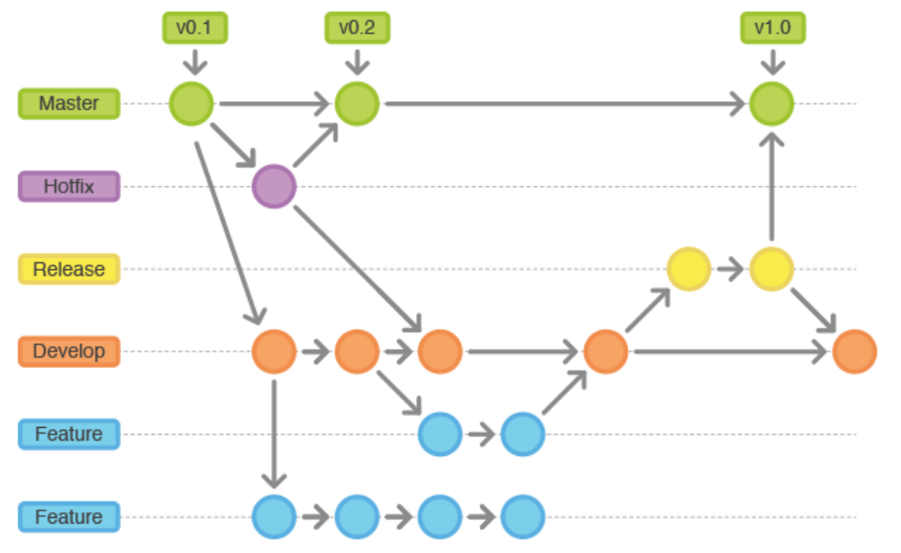
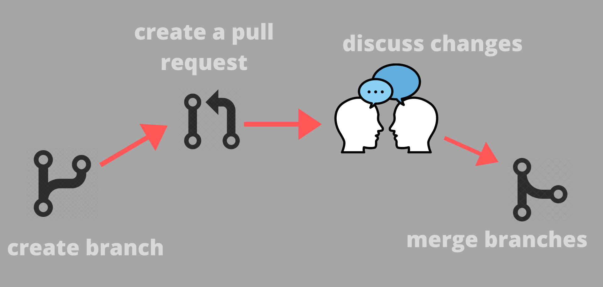

# 1. Trabajo colaborativo avanzado con GitHub

Este documento presenta estrategias avanzadas para optimizar el trabajo colaborativo utilizando GitHub como plataforma de control de versiones. El objetivo es mejorar significativamente la calidad del código y agilizar el proceso de desarrollo mediante pull requests y revisiones efectivas.

## Índice

- [Flujos de trabajo avanzados con Git Flow](#flujos-de-trabajo-avanzados-con-git-flow)
- [Gestión efectiva de pull requests](#gestión-efectiva-de-pull-requests)
- [Revisión avanzada de código](#revisión-avanzada-de-código)

## Flujos de trabajo avanzados con Git Flow

Git Flow es un modelo de flujo de trabajo robusto que permite gestionar desarrollos complejos y múltiples funcionalidades en paralelo. Sus principales ramas son:

- **main (master)**: Rama de producción estable.
- **develop**: Rama principal de integración para nuevas funcionalidades.
- **feature branches**: Ramas para desarrollar funcionalidades individuales.
- **release branches**: Preparan una nueva versión del proyecto para producción.
- **hotfix branches**: Aplican correcciones rápidas a la rama main.



### Ejemplo de flujo básico con Git Flow:

```bash
# Crear rama de funcionalidad desde develop
git checkout -b feature/new-functionality develop

# Desarrollar y hacer commits

# Integrar cambios a develop
git checkout develop
git merge feature/new-functionality
```

## Gestión efectiva de pull requests

Las pull requests (PR) son el núcleo de la colaboración efectiva en GitHub. Algunas recomendaciones para maximizar su eficiencia son:

- **PR pequeños y frecuentes**: facilita la revisión y reduce conflictos.
- **Títulos claros y descriptivos**: ayudan a identificar rápidamente el propósito de los cambios.
- **Descripción detallada**: incluir contexto, motivo de los cambios y referencias a tareas relacionadas.
- **Etiquetas y asignaciones**: Usar etiquetas para categorizar los PR y asignar revisores adecuados.



### Ejemplo de creación efectiva de PR:

- **Título**: Añadir validación al formulario de registro
- **Descripción**: Este PR añade validación a los campos del formulario de registro, resolviendo la tarea #24.

## Revisión avanzada de código

La revisión del código es crucial para mantener la calidad del proyecto. Algunas buenas prácticas en la revisión avanzada son:

- **Revisar funcionalidad y lógica**, no solo estilo.
- **Proporcionar feedback constructivo y claro**, sugiriendo alternativas cuando sea posible.
- **Usar comentarios específicos y acciones sugeridas**, evitando ambigüedades.
- **Resolver dudas directamente en los comentarios del PR** para mantener la discusión organizada.

### Ejemplo de comentario útil en revisión:

> "La lógica aquí funciona bien, pero se podría simplificar con un método auxiliar. ¿Qué te parece mover esto a una función separada para mejorar la legibilidad?"

Aplicando estas prácticas avanzadas, el equipo podrá colaborar de manera más eficaz, manteniendo la calidad y claridad del código del proyecto.
