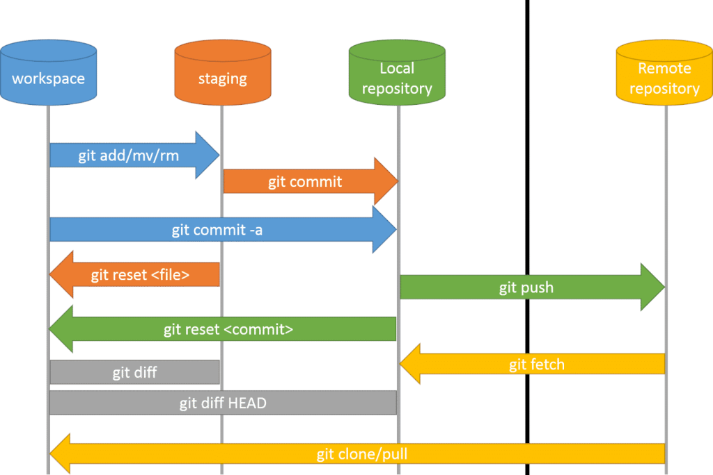

# 4. Buenas prácticas y resolución avanzada de problemas

## Índice

- [Comandos avanzados desde línea de comandos](#comandos-avanzados-desde-línea-de-comandos)
- [Mantener un historial limpio y ordenado](#mantener-un-historial-limpio-y-ordenado)
- [Manejo avanzado de errores comunes](#manejo-avanzado-de-errores-comunes)

## Comandos avanzados desde línea de comandos

Conocer y utilizar comandos avanzados desde la consola permite mayor control y claridad sobre las operaciones del repositorio. Algunos comandos clave con ejemplos de uso son:

- **git rebase**: Reorganizar y limpiar la historia de commits antes de integrarlos a una rama principal.
  ```bash
  git checkout feature-branch
  git rebase main
  ```

- **git cherry-pick**: Aplicar cambios específicos desde un commit individual sin traer otros cambios indeseados.
  ```bash
  git cherry-pick <commit-hash>
  ```

- **git stash**: Guardar temporalmente cambios no committed para cambiar de rama o aplicar otros cambios.
  ```bash
  # Guardar cambios
  git stash "Mensaje descriptivo"
  
  # Listar stashes
  git stash list
  
  # Aplicar y eliminar el último stash
  git stash pop
  
  # Solo aplicar sin eliminar un stash
  git stash apply stash@{0}
  ```

- **git revert**: Crear un nuevo commit que deshace los cambios introducidos en otro commit previo, útil para revertir errores rápidamente.
  ```bash
  git revert <commit-hash>
  ```

## Mantener un historial limpio y ordenado

Un historial claro y limpio facilita entender los cambios realizados y simplifica enormemente la resolución de conflictos. Para conseguir esto, es recomendable:

- Crear commits pequeños, atómicos y descriptivos.
- Evitar commits genéricos o poco informativos (como "correcciones varias" o "actualización").
- Usar ramas específicas por tarea o funcionalidad.
- Mantener un estándar claro en los mensajes de commit.

## Manejo avanzado de errores comunes

Existen errores y problemas comunes al usar Git que tienen soluciones concretas:

- **git revert**: permite revertir un commit que ya está integrado, generando un nuevo commit que deshace los cambios realizados anteriormente.
  ```bash
  git revert <commit-hash>
  ```

- **git reset**: permite deshacer cambios locales, mover ramas a commits específicos, o eliminar commits no deseados antes de enviarlos al remoto.
  ```bash
  # Soft reset (mantiene cambios en staging)
  git reset --soft <commit-hash>

  # Mixed reset (mantiene cambios sin staging)
  git reset --mixed <commit-hash>

  # Hard reset (descarta completamente los cambios)
  git reset --hard <commit-hash>
  ```

- **git reflog**: proporciona un histórico detallado de todas las operaciones realizadas en Git, permitiendo recuperar commits y ramas aparentemente "perdidas".
  ```bash
  git reflog
  ```

Estos comandos proporcionan soluciones prácticas a problemas habituales en el uso avanzado de Git en proyectos como los desarrollados en Unity.


